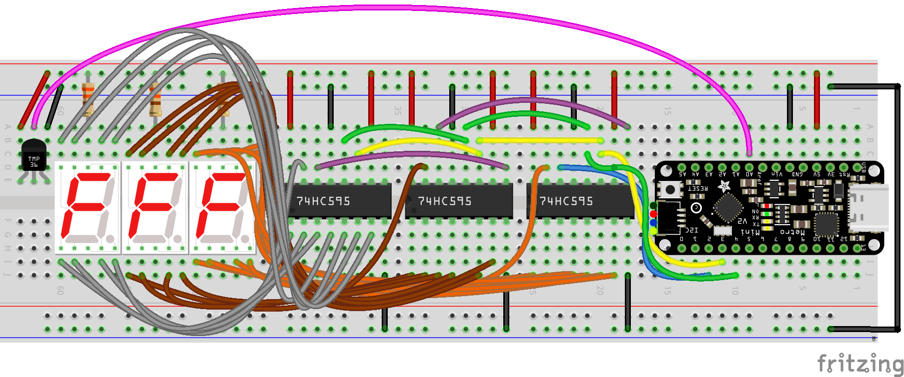
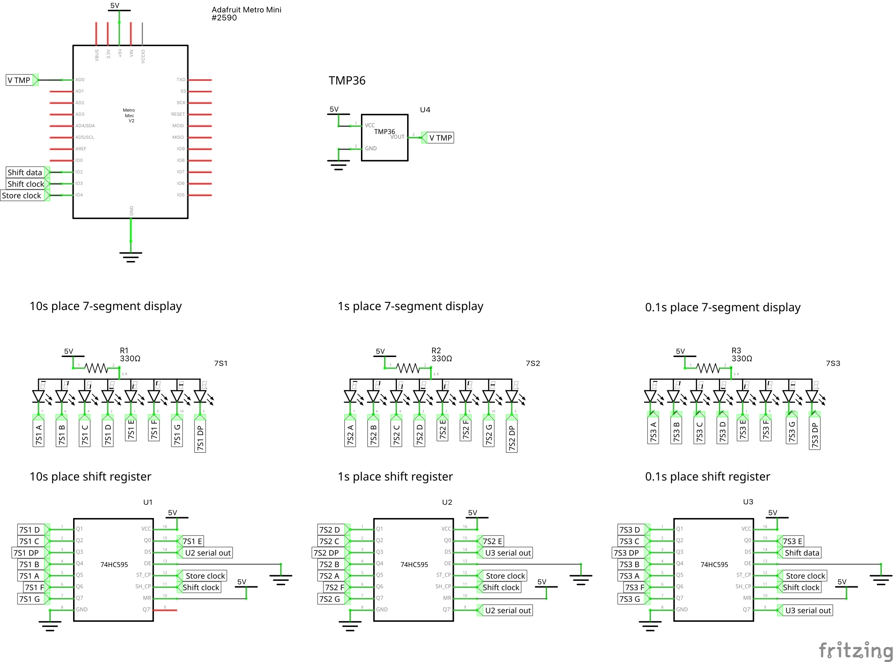

## Arduino 7-segment temperature display

This sketch reads the temperature from a TMP36, and displays it on three
7-segment LEDs, via three shift registers.

It uses the `INTERNAL` voltage (about 1.1V) as the analog reference, as the
TMP36 only reaches 1V at about 50°C, and I'm using this as a basic room
thermometer.

The `INTERNAL` voltage on an Atmega 328P isn't exactly 1.1V, so you'll want to
[measure the voltage on your particular chip][measure] and substitute in the
value in millivolts. You could use the default analog reference (5V), but then
you'll only be able to measure in roughly 0.5°C increments.

[measure]: https://forum.arduino.cc/t/measurement-of-bandgap-voltage/38215/4

### Breadboard wiring

There are a lot of wires! Each 7-segment display takes 8 wires, for 24 wires total.
Each display is wired up in the same way, with Q0 from the shift register wired to
pin 1 (segment E) of the display.

### Schematic

Note that the data is shifted out from the Metro Mini to U3, the tenths-place
shift register, which is in turn chained to U2 (U3 Q7' to U2 data in), which is
in turn chained to U1.
